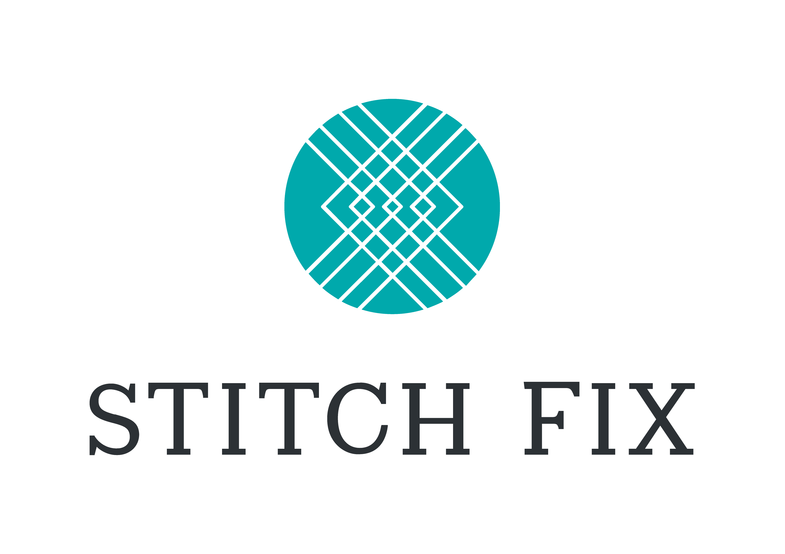

<h1></h1>

<h3>Hi, I'm Jessica! 👋🏻</h3>

  
    
  

<h1></h1>

  <h3>Featured Projects: 
    <a href="https://lajuntacrafts.com/">La Junta Crafts</a>
  </h3>
  

  
  

    
La Junta Crafts website is a full-stack e-commerce application built with React.js, Flask, and PostgreSQL.

  

<h3>
      <a href="https://stitch-fix-clone.onrender.com/">Stitch Fix Clone</a>
  </h3>
  

  
  

    
Front-end clone of Stitch Fix September 2023 home website built with React.

  

<h1></h1>

<h3>Skills</h3>

<em>Languages:</em> JavaScript · Python · Ruby · HTML · CSS

<em>Frameworks/Libraries:</em> React · Flask · Ruby on Rails · RESTful APIs · Tailwind · Twig

<em>Databases:</em> MySQL(SQL) · MongoDB(NoSQL)

<em>Tools:</em> Git · GitHub · Docker · Gulp

<h1></h1>
